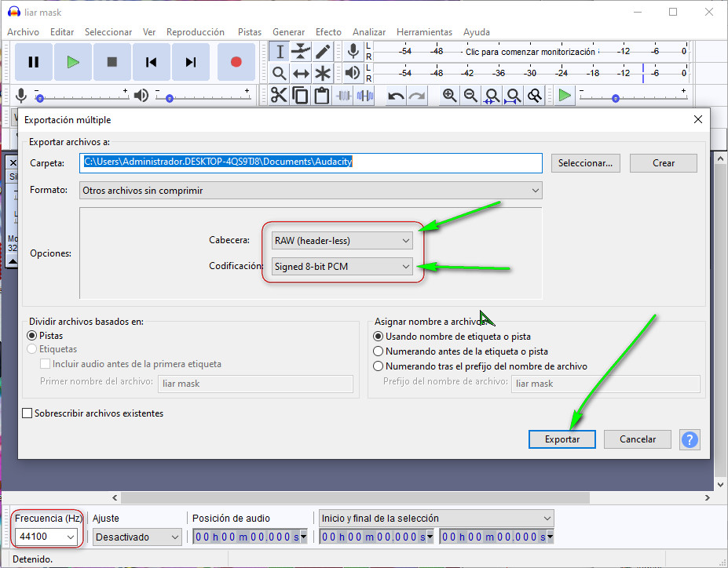

# SoundNX
Layered FS  Replace for the Nintendo Switch 

It is a replacement for the original sounds of the console.
such as The sliding of the joycons, notifications, screenshots and others.

At the moment I am only changing the sounds of (The sliding of the joycons).

The format supported by the switch is format (RAW audio Signed-8bit PCM) at 44100 Hz.

You can use Audacity to get this format

The routes are 
<yourCFWfolder>/titles/010000000000100C/romfs/sound

More information about Titles ID [Here](https://switchbrew.org/wiki/Title_list)

Unpacked ID titles [Here](https://drive.google.com/drive/folders/1wPCyMkk4bJBu7BTqwtngSc0t1skTdIS5?usp=sharing)

[Video](https://youtu.be/HXEgrBTy-Ps)

## [Discord](https://discord.io/myrincon)
